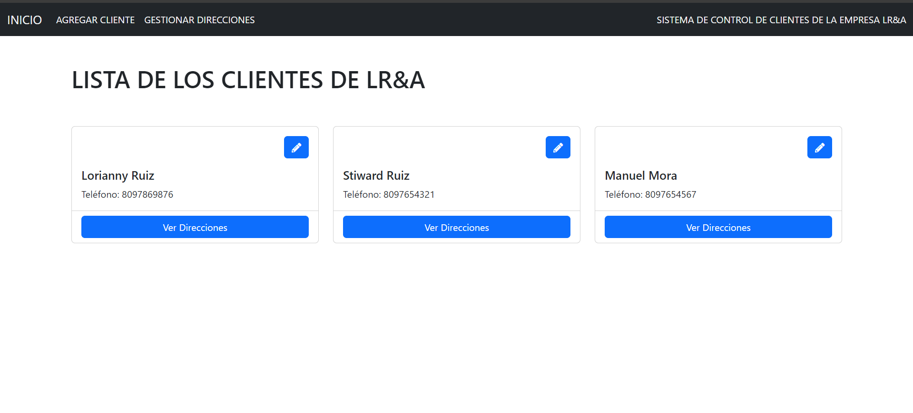

ControlClientesFront --con Angular

ControlClientesBack --con .NET CORE Y POSTGRESQL

-Para correr el ControlClientesBack es solo correr el proyecto y se hara la migracion automatica.
-Para correr el ControlClientesFront es solo clonar el repositorio, instalar NODE.JS y hacer el ng serve -o
-Asegurarse que el Back corra en el puerto https://localhost:7012/

Gracias por la oportunidad!!
